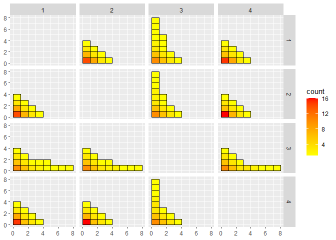
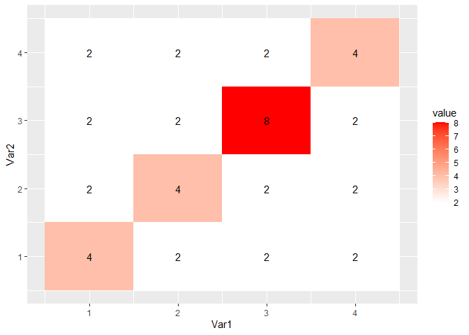
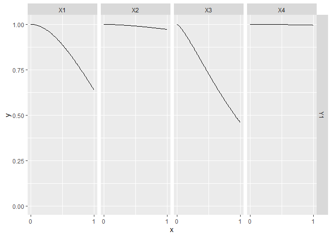
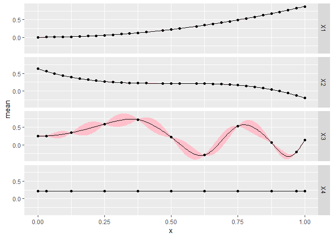
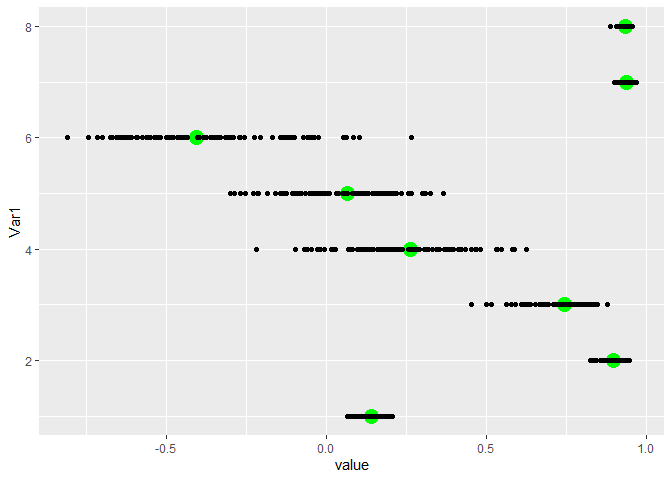
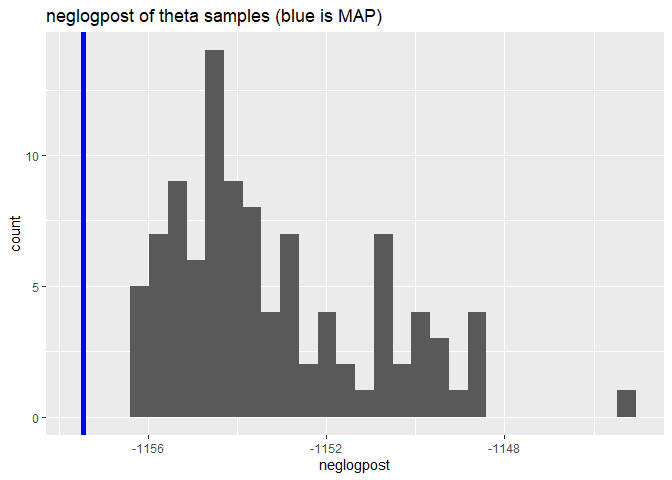

<!-- README.md is generated from README.Rmd. Please edit that file -->

# CGGP

[](https://travis-ci.org/CollinErickson/CGGP)
[](https://codecov.io/github/CollinErickson/CGGP?branch=master)

The goal of CGGP is to provide a sequential design of experiment
algorithm that can efficiently use many points and interpolate exactly.

## Installation

You can install CGGP from GitHub with:

``` r
# install.packages("devtools")
devtools::install_github("CollinErickson/CGGP")
```

## Example

To create a CGGP object:

``` r
## basic example code
library(CGGP)
d <- 4
CG <- CGGPcreate(d=d,200)
print(CG)
#> CGGP object
#>    d = 4
#>    CorrFunc = CauchySQ
#>    number of design points             = 197
#>    number of unevaluated design points = 197
#>    Available functions:
#>      - CGGPfit(CGGP, Y) to update parameters with new data
#>      - CGGPpred(CGGP, xp) to predict at new points
#>      - CGGPappend(CGGP, batchsize) to add new design points
#>      - CGGPplot<name>(CGGP) to visualize CGGP model
```

A new `CGGP` object has design points that should be evaluated next,
either from `CG$design` or
`CG$design_unevaluated`.

``` r
f <- function(x) {x[1]^2*cos(x[3]) + 4*(0.5-x[2])^3*(1-x[1]/3) + x[1]*sin(2*2*pi*x[3]^2)}
Y <- apply(CG$design, 1, f)
```

Once you have evaluated the design points, you can fit the object with
`CGGPfit`.

``` r
CG <- CGGPfit(CG, Y)
CG
#> CGGP object
#>    d = 4
#>    CorrFunc = CauchySQ
#>    number of design points             = 197
#>    number of unevaluated design points = 0
#>    Available functions:
#>      - CGGPfit(CGGP, Y) to update parameters with new data
#>      - CGGPpred(CGGP, xp) to predict at new points
#>      - CGGPappend(CGGP, batchsize) to add new design points
#>      - CGGPplot<name>(CGGP) to visualize CGGP model
```

If you want to use the model to make predictions at new input points,
you can use `CGGPpred`.

``` r
xp <- matrix(runif(10*CG$d), ncol=CG$d)
CGGPpred(CG, xp)
#> $mean
#>                [,1]
#>  [1,]  0.0001162884
#>  [2,] -0.0344228978
#>  [3,] -0.0196339461
#>  [4,]  0.7418505766
#>  [5,]  0.4708991004
#>  [6,] -0.2423823333
#>  [7,]  0.1824982528
#>  [8,]  0.0323529025
#>  [9,]  0.4261492247
#> [10,] -0.2613434429
#> 
#> $var
#>               [,1]
#>  [1,] 7.974964e-06
#>  [2,] 1.492197e-06
#>  [3,] 1.537227e-05
#>  [4,] 2.460356e-05
#>  [5,] 1.117700e-05
#>  [6,] 1.654354e-05
#>  [7,] 8.025908e-07
#>  [8,] 7.446481e-06
#>  [9,] 5.917793e-06
#> [10,] 1.421730e-05
```

To add new design points to the already existing design, use
`CGGPappend`. It will use the data already collected to find the most
useful set of points to evaluate next.

``` r
# To add 100 points
CG <- CGGPappend(CG, 100)
```

Now you will need to evaluate the points added to `CG$design`, and refit
the model.

``` r
ynew <- apply(CG$design_unevaluated, 1, f)
CG <- CGGPfit(CG, Ynew=ynew)
```

### Plot functions

There are a few functions that will help visualize the CGGP design.

#### `CGGPplotblocks`

`CGGPplotblocks` shows the block structure when projected down to all
pairs of two dimensions. The plot is symmetric. The facet labels be a
little bit confusing. The first column has the label 1, and it looks
like it is saying that the x-axis for each plot in that column is for
`X1`, but it is actually the y-axis that is `X1` for each plot in that
column.

``` r
CGGPplotblocks(CG)
```

<!-- -->

#### `CGGPplotheat`

`CGGPplotheat` is similar to `CGGPplotblocks` and can be easier to read
since it is only a single plot. The \((i,j)\) entry shows the maximum
value for which a block was selected with \(X_i\) and \(X_j\) at least
that large. The diagonal entries, \((i, i)\), show the maximum depth for
\(X_i\). A diagonal entry must be at least as large as any entry in its
column or row. This plot is also symmetric.

``` r
CGGPplotheat(CG)
```

<!-- -->

#### `CGGPhist`

`CGGPhist` shows histograms of the block depth in each direction. The
dimensions that have more large values are dimensions that have been
explored more. These should be the more active dimensions.

``` r
CGGPplothist(CG)
#> Warning: Transformation introduced infinite values in continuous y-axis
#> Warning: Removed 4 rows containing missing values (geom_bar).
```

<!-- -->

#### `CGGPplotcorr`

`CGGPplotcorr` gives an idea of what the correlation structure in each
dimension is. The values plotted do not represent the actual data given
to CGGP. Each wiggly line represents a random Gaussian process drawn
using the correlation parameters for that dimension from the given CGGP
model. Dimensions that are more wiggly and have higher variance are the
more active dimensions. Dimensions with nearly flat lines mean that the
corresponding input dimension has a relatively small effect on the
output.

``` r
CGGPplotcorr(CG)
```

<!-- -->

#### `CGGPplotvariogram`

`CGGPplotvariogram` shows something similar to the semi-variogram for
the correlation parameters found for each dimension. Really it is just
showing how the correlation function decays for points that are further
away. It should always start at `y=1` for `x=0` and decrease in `y` as
`x` gets larger

``` r
CGGPplotvariogram(CG)
```

<!-- -->

#### `CGGPplotprojection`

`CGGPplotprojection` shows what the predicted model along each
individual dimension when the other input dimensions are held constant,
i.e., the projections down to single dimensions. By default the
projection is done holding all other inputs at 0.5, but this can be
changed by changing the argument `proj`. The black dots are the data
points that are in that projection. If you change `proj` to have values
not equal to 0.5, you probably won’t see any black dots. The pink
regions are the 95% prediction intervals.

This plot is the best for giving an idea of what the higher dimension
function look like. You can see how the output changes as each input is
varied.

``` r
CGGPplotprojection(CG)
```

<!-- -->

The next plot changes so that all the other dimensions are held constant
at 0.15 for each projection plot. When moving from the center line, the
error bounds generally should be larger since it is further from the
data, but we should see similar patterns unless the function is highly
nonlinear.

``` r
CGGPplotprojection(CG, proj = rep(.15, CG$d))
```

<!-- -->

#### `CGGPplottheta`

`CGGPplottheta` is useful for getting an idea of how the samples for the
correlation parameters (theta) vary compared to the maximum a posteriori
(MAP). This may be helpful when using `UCB` or `TS` in `CGGPappend` to
get an idea of how much uncertainty there is in the parameters. Note
that there are likely multiple parameters for each input dimension.

``` r
CGGPplottheta(CG)
```

<!-- -->

#### `CGGPplotsamplesneglogpost`

`CGGPplotsamplesneglogpost` shows the negative log posterior for each of
the different samples for theta. The value for the MAP is shown as a
blue line. It should be at the far left edge if it is the true MAP.

``` r
CGGPplotsamplesneglogpost(CG)
```

<!-- -->
