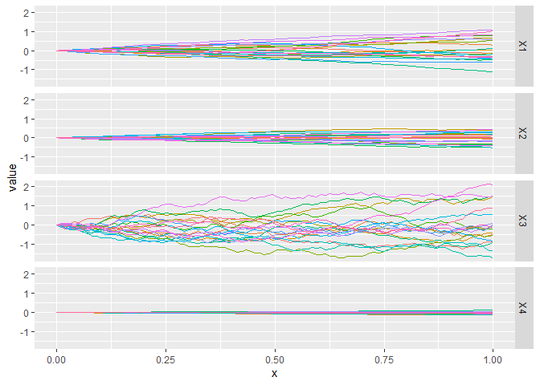

<!-- README.md is generated from README.Rmd. Please edit that file -->

# SGGP

[](https://travis-ci.org/CollinErickson/SGGP)
[](https://codecov.io/github/CollinErickson/SGGP?branch=master)

The goal of SGGP is to provide a sequential design of experiment
algorithm that can efficiently use many points and interpolate exactly.

## Installation

You can install SGGP from github with:

``` r
# install.packages("devtools")
devtools::install_github("CollinErickson/SGGP")
```

## Example

To create a SGGP object:

``` r
## basic example code
library(SGGP)
d <- 4
SG <- SGGPcreate(d=d,200)
print(SG)
#> SGGP object
#>    d = 4
#>    number of design points = 197
#>    number of unevaluated design points = 197
#>    Available functions:
#>      - SGGPfit(SGGP, Y) to update parameters with new data
#>      - sGGPpred(Xp, SGGP) to predict at new points
#>      - SGGPappend(SGGP, batchsize) to add new design points
```

A new `SGGP` object has design points that should be evaluated next,
either from `SG$design` or `SG$design_unevaluated`.

``` r
f <- function(x) {x[1]^2 + 4*(0.5-x[2])^3 + x[1]*sin(2*2*pi*x[3]^2)}
Y <- apply(SG$design, 1, f)
```

Once you have evaluated the design points, you can fit the object with
`SGGPfit`.

``` r
SG <- SGGPfit(SG, Y)
SG
#> SGGP object
#>    d = 4
#>    number of design points = 197
#>    number of unevaluated design points = 0
#>    Available functions:
#>      - SGGPfit(SGGP, Y) to update parameters with new data
#>      - sGGPpred(Xp, SGGP) to predict at new points
#>      - SGGPappend(SGGP, batchsize) to add new design points
```

If you want to use the model to make predictions at new input points,
you can use `SGGPpred`.

``` r
xp <- matrix(runif(10*SG$d), ncol=SG$d)
SGGPpred(xp, SG)
#> $mean
#>              [,1]
#>  [1,] -0.26835444
#>  [2,]  0.50472256
#>  [3,]  0.42244512
#>  [4,]  1.38231071
#>  [5,]  0.05322841
#>  [6,]  0.20604725
#>  [7,]  0.41018218
#>  [8,]  0.16879444
#>  [9,]  0.39039751
#> [10,]  1.23489508
#> 
#> $var
#>  [1] 0.0024488401 0.0089301441 0.0002442289 0.0009809289 0.0109454204
#>  [6] 0.0140288822 0.0016327786 0.0073906167 0.0017421508 0.0062341353
```

To add new design points to the already existing design, use
`SGGPappend`. It will use the data already collected to find the most
useful set of points to evaluate next.

``` r
# To add 100 points
SG <- SGGPappend(SG, 100)
```

Now you will need to evaluate the points added to `SG$design`, and refit
the model.

``` r
ynew <- apply(SG$design_unevaluated, 1, f)
SG <- SGGPfit(SG, Ynew=ynew)
```

There are a few functions that will help visualize the design.

`SGGPblockplot` shows the block structure when projected down to all
pairs of two dimensions.

``` r
SGGPblockplot(SG)
```

<!-- -->

`SGGPhist` shows histograms of how far the blocks extend in each
direction.

``` r
SGGPhist(SG)
#> Warning: Transformation introduced infinite values in continuous y-axis
#> Warning: Removed 7 rows containing missing values (geom_bar).
```

<!-- -->

``` r
SGGPcorrplot(SG)
```

<!-- -->

``` r
SGGPprojectionplot(SG)
```

<!-- -->

``` r
SGGPheat(SG)
```

<!-- -->
